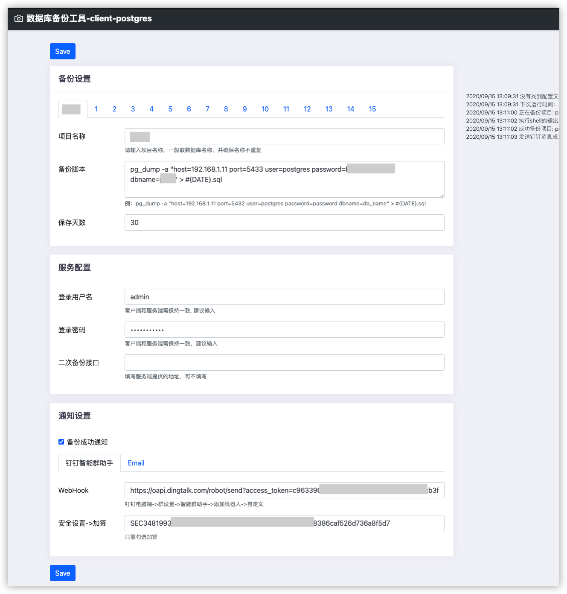

## backup databases
  Support all databases and the database images can be find in docker.
  - [X] Support for custom backup commands.
  - [X] Obsolete files will be deleted automatically.
  - [X] You can copy the backup files to another server.
  - [x] Send email when backup failed.
  - [x] The server checks the backup files that are not uploaded at 10 o'clock every day. If the backup files are not checked, an email notice will be sent
  - [x] Automatic backup in every night.
  - [x] The maximum number of days to save backup files can be set.
  - [x] Use web configuration

## use in docker
[https://github.com/jeessy2/backup-db/releases](https://github.com/jeessy2/backup-db/releases)

