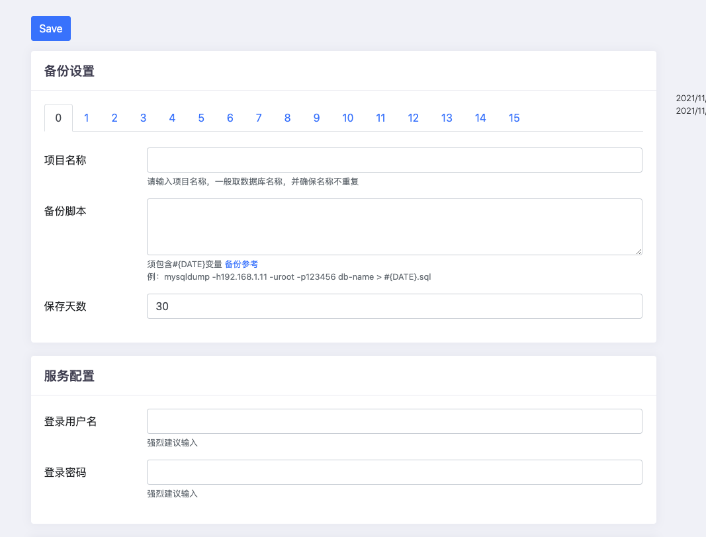

# 数据库备份工具 [English](README-EN.md)
  原理：在原生的docker镜像基础上，加入一备份工具，增强备份功能。
  提供postgres, mysql5, mysql8镜像，可直接使用，如有需要请提issues。
  - [X] 支持自定义命令
  - [X] 可以把备份后的文件存入另一台服务器
  - [X] 备份失败邮件通知
  - [X] 服务端每日10点检查上传的备份文件，如未检查到发邮件通知
  - [X] 每日凌晨自动备份
  - [X] 可设置备份文件最大保存天数
  - [x] 网页中配置，简单又方便
  - [x] 网页中方便快速查看最近50条日志
  - [x] 可设置登陆用户名密码，默认为空

# 1.x.x版本不兼容 0.0.x



## server
```
docker run -d \
  --name backup-db-server \
  --restart=always \
  -p 9977:9977 \
  -v /opt/backup-files:/app/backup-files \
  jeessy/backup-db:v1.0.0-server
```


## client (postgress)
```
docker run -d \
  --name backup-db-postgres \
  --restart=always \
  -p 9977:9977 \
  -v /opt/backup-files:/app/backup-files \
  jeessy/backup-db:v1.0.0-postgres
```

## client (mysql5)
```
docker run -d \
  --name backup-db-mysql5 \
  --restart=always \
  -p 9977:9977 \
  -v /opt/backup-files:/app/backup-files \
  jeessy/backup-db:v1.0.0-mysql5
```

## client (mysql8)
```
docker run -d \
  --name backup-db-mysql8 \
  --restart=always \
  -p 9977:9977 \
  -v /opt/backup-files:/app/backup-files \
  jeessy/backup-db:v1.0.0-mysql8
```

## Release
```
# 自动发布
git tag v0.0.x -m "xxx" 
git push --tags
```